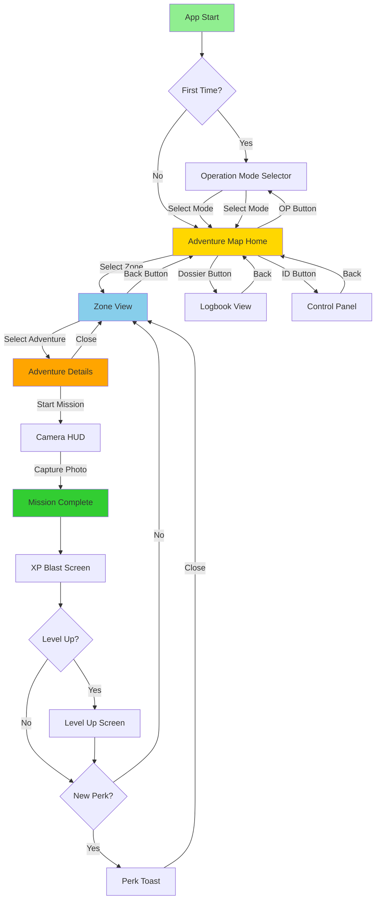
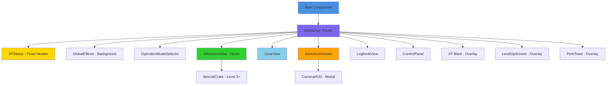
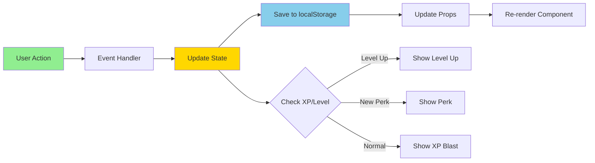

# Buiten de Lijntjes - App Structuur & Flowchart

## 📱 App Architectuur Overzicht

### Visuele Flowchart



### Component Hiërarchie Diagram



### State Flow Diagram



```
┌─────────────────────────────────────────────────────────────┐
│                        MAIN COMPONENT                        │
│  ┌───────────────────────────────────────────────────────┐ │
│  │ State Management (localStorage: 'bdl_save_v7')         │ │
│  │ - completed: [] (array van adventure IDs)             │ │
│  │ - xp: 0 (totaal XP)                                    │ │
│  │ - photos: [] (array van foto objecten)                 │ │
│  │ - perks: [] (array van perk IDs)                       │ │
│  │ - codename: '' (gebruikers codenaam)                   │ │
│  │ - operationMode: 'outdoor' | 'indoor'                  │ │
│  └───────────────────────────────────────────────────────┘ │
│                                                              │
│  ┌───────────────────────────────────────────────────────┐ │
│  │              MOBILE APP (Router)                       │ │
│  │  State: view, activeZone, activeAdventure              │ │
│  │  Modals: showBlast, showLevelUp, showPerk              │ │
│  └───────────────────────────────────────────────────────┘ │
└─────────────────────────────────────────────────────────────┘
```

## 🗺️ Navigatie Flow

```
                    ┌─────────────────┐
                    │   APP START    │
                    └────────┬───────┘
                             │
                             ▼
                    ┌─────────────────┐
                    │  Eerste keer?   │
                    └────────┬───────┘
                             │
                ┌────────────┴────────────┐
                │                         │
                ▼                         ▼
    ┌───────────────────────┐  ┌──────────────────────┐
    │ OPERATION MODE        │  │   (Skip to Home)      │
    │ SELECTOR              │  │                      │
    │                       │  │                      │
    │ [BUITEN] [BINNEN]     │  │                      │
    └───────────┬───────────┘  └──────────┬───────────┘
                │                         │
                └────────────┬────────────┘
                             │
                             ▼
                    ┌─────────────────┐
                    │   ADVENTURE MAP  │ ◄──┐
                    │   (Home View)    │    │
                    └────────┬─────────┘    │
                             │              │
        ┌────────────────────┼──────────────┼──────────────┐
        │                    │              │              │
        ▼                    ▼              ▼              │
┌───────────────┐  ┌──────────────┐  ┌──────────────┐  │
│  ZONE VIEW    │  │ CONTROL PANEL │  │   LOGBOOK    │  │
│               │  │  (Identity)   │  │  (Photos)    │  │
│ [Zone Name]   │  │               │  │              │  │
│               │  │ [Codename]    │  │ [Photo Grid] │  │
│ [Adventures]  │  │ [Refresh]     │  │              │  │
└───────┬───────┘  └───────┬───────┘  └──────┬───────┘  │
        │                  │                  │          │
        │                  └──────────────────┘          │
        │                          │                     │
        ▼                          │                     │
┌───────────────┐                 │                     │
│ ADVENTURE     │                 │                     │
│ DETAILS       │                 │                     │
│               │                 │                     │
│ [Mission Info]│                 │                     │
│ [Start]       │                 │                     │
└───────┬───────┘                 │                     │
        │                          │                     │
        │                          │                     │
        ▼                          │                     │
┌───────────────┐                 │                     │
│  CAMERA HUD   │                 │                     │
│               │                 │                     │
│ [Take Photo]  │                 │                     │
└───────┬───────┘                 │                     │
        │                          │                     │
        │                          │                     │
        └──────────┬───────────────┘                     │
                   │                                     │
                   ▼                                     │
        ┌──────────────────────┐                        │
        │  COMPLETION FLOW     │                        │
        │                      │                        │
        │  1. XP Blast Screen  │                        │
        │  2. Level Up?        │                        │
        │  3. Perk Unlock?     │                        │
        └──────────┬───────────┘                        │
                   │                                     │
                   └─────────────────────────────────────┘
```

## 🎯 View States & Transitions

### MobileApp View States:
- `'mode-select'` → Operation Mode Selector (eerste keer)
- `'home'` → AdventureMap (hoofdscherm)
- `'zone'` → ZoneView (zone met adventures)
- `'adventure'` → AdventureDetails (missie details)
- `'logbook'` → LogbookView (foto's dossier)
- `'control'` → ControlPanel (codename generator)

### Modal States (overlays):
- `showBlast` → XP celebration screen
- `showLevelUp` → Level up notification
- `showPerk` → Perk unlock notification
- `showCamera` → Camera interface (in AdventureDetails)

## 📊 Component Hiërarchie

```
Main
├── MobileApp (Router)
│   ├── XPStatus (Fixed Header - altijd zichtbaar)
│   ├── GlobalEffects (Background effects)
│   │
│   ├── OperationModeSelector
│   │   └── [BUITEN] / [BINNEN] buttons
│   │
│   ├── AdventureMap (Home)
│   │   ├── Header (Title + Buttons)
│   │   ├── Zone Cards (ZONES of INDOOR_ZONES)
│   │   └── SpecialCrate (Level 3+)
│   │
│   ├── ZoneView
│   │   ├── Sticky Header (Zone Name + Icon)
│   │   └── Adventure Cards List
│   │
│   ├── AdventureDetails
│   │   ├── Mission Info
│   │   ├── Supplies List
│   │   ├── Steps List
│   │   └── [Start Mission] Button
│   │       └── CameraHUD (when clicked)
│   │
│   ├── LogbookView
│   │   └── Photo Grid (reverse chronological)
│   │
│   └── ControlPanel
│       └── Codename Generator
│
│   ┌─ Overlays (AnimatePresence) ─┐
│   │                               │
│   ├── XP Blast Screen             │
│   ├── LevelUpScreen               │
│   └── PerkToast                   │
│                                   │
└── Desktop Placeholder (if !isMobile)
```

## 🎮 Data Flow

### State Management Flow:

```
User Action
    │
    ▼
MobileApp Handler
    │
    ├─► handleComplete() ──┐
    │                       │
    │   ┌───────────────────▼──────────────────┐
    │   │ 1. Calculate new XP                  │
    │   │ 2. Check for level up                │
    │   │ 3. Check for new perks               │
    │   │ 4. Show XP blast                     │
    │   │ 5. Show level up (if applicable)     │
    │   │ 6. Show perk (if applicable)         │
    │   └───────────────────┬──────────────────┘
    │                       │
    └───────────────────────┘
            │
            ▼
    Main.handleComplete()
            │
            ├─► Update state
            ├─► Save to localStorage
            └─► Update MobileApp props
```

### Zone Selection Flow:

```
AdventureMap
    │
    ├─► onSelectZone(zone)
    │       │
    │       ├─► setActiveZone(zone)
    │       └─► setView('zone')
    │
    └─► ZoneView
            │
            ├─► onSelectAdventure(adventure)
            │       │
            │       ├─► setActiveAdventure(adventure)
            │       └─► setView('adventure')
            │
            └─► AdventureDetails
                    │
                    └─► handleStartMission()
                            │
                            └─► setShowCamera(true)
                                    │
                                    └─► CameraHUD
                                            │
                                            └─► onCapture(photoData)
                                                    │
                                                    └─► handleComplete()
```

## 📦 Data Structures

### Zone Object:
```javascript
{
  id: string,              // 'bos', 'base_alpha', etc.
  title: string,           // 'DANGER ZONE: BOS'
  subtitle: string,        // 'ONBEKEND TERREIN'
  minLevel: number,        // 1-4
  color: string,          // Tailwind class 'bg-emerald-900'
  accent: string,          // Tailwind class 'text-emerald-400'
  border: string,          // Tailwind class 'border-emerald-500'
  iconName: string,        // Lucide icon name 'Trees'
  description: string,    // Zone description
  adventures: Adventure[]  // Array of adventures
}
```

### Adventure Object:
```javascript
{
  id: string,              // 'fort-bouwen', 'kussen-fort', etc.
  title: string,           // 'BOUW EEN SCHUILPLAATS'
  intro: string,          // Mission intro text
  difficulty: string,      // 'HARD', 'MEDIUM', 'EASY', etc.
  xp: number,             // XP reward (100-400)
  supplies: string[],      // Required items
  steps: string[]         // Mission steps
}
```

### State Object:
```javascript
{
  completed: string[],     // Array of completed adventure IDs
  xp: number,             // Total XP points
  photos: Photo[],        // Array of photo objects
  perks: string[],        // Array of perk IDs
  codename: string,       // User codename
  operationMode: string   // 'outdoor' | 'indoor'
}
```

### Photo Object:
```javascript
{
  id: number,             // Timestamp
  data: string,           // Base64 image data
  missionTitle: string,   // Adventure title
  date: string            // Formatted date
}
```

## 🔄 Operation Mode System

```
operationMode: 'outdoor' | 'indoor'
    │
    ├─► 'outdoor' → Uses ZONES array
    │   └─► Zones: bos, tuin, nacht, makers
    │
    └─► 'indoor' → Uses INDOOR_ZONES array
        └─► Zones: base_alpha, labo, gang, luchtruim
```

### Mode Switching:
- Button in AdventureMap header (OP button)
- Switches between outdoor/indoor
- Updates localStorage
- Changes zone list displayed

## 🎯 XP & Leveling System

### Level Thresholds:
- Level 1 (ROOKIE): 0 XP
- Level 2 (SCOUT): 300 XP
- Level 3 (RANGER): 800 XP
- Level 4 (LEGEND): 1600 XP

### Perks System:
- `first_blood`: First mission completed
- `night_owl`: Night mission completed ('licht-signalen')
- `builder`: Building mission completed ('fort-bouwen' OR 'kussen-fort')
- `veteran`: 5 missions completed
- `master`: Level 4 reached (1600 XP)

### Completion Flow:
```
Mission Complete
    │
    ├─► Calculate XP
    ├─► Check level up
    ├─► Check perks
    │
    ├─► Show XP Blast (2.5s)
    │   │
    │   ├─► If level up → Show LevelUpScreen
    │   └─► Else if perk → Show PerkToast
    │
    └─► Update state & localStorage
```

## 🎨 UI Components Breakdown

### Fixed Components (always visible):
- **XPStatus**: Top bar with level, XP progress, perks badges
- **GlobalEffects**: Background scanlines, grid pattern

### View Components:
- **AdventureMap**: Zone selection grid
- **ZoneView**: Adventure list for selected zone
- **AdventureDetails**: Mission briefing and start button
- **LogbookView**: Photo gallery
- **ControlPanel**: Codename generator
- **OperationModeSelector**: Initial mode selection

### Modal/Overlay Components:
- **CameraHUD**: Camera interface for mission proof
- **XP Blast Screen**: Celebration animation
- **LevelUpScreen**: Level up notification
- **PerkToast**: Perk unlock notification

## 🔐 Persistence

### localStorage Key: `'bdl_save_v7'`

Stores complete state object:
- Survives page refresh
- Loaded on app start
- Updated on every state change

## 🎵 Audio System

### Background Music:
- File: `@audio/buitendelijntjes_score.mp3`
- Volume: 30%
- Loop: true
- Autoplay: Attempts on load, falls back to user interaction

### Sound Effects:
- Click sound: Web Audio API (800Hz sine wave)
- Used in: Codename generator refresh button

## 📱 Responsive Design

### Mobile (< 768px):
- Full app functionality
- Touch-optimized UI
- Camera access

### Desktop (≥ 768px):
- Shows "FIELD DEVICE REQUIRED" message
- Prompts user to open on mobile

---

## 🔗 Key Navigation Paths

### Main Flow:
1. **Start** → Mode Select (first time) → Home
2. **Home** → Select Zone → Zone View
3. **Zone View** → Select Adventure → Adventure Details
4. **Adventure Details** → Start Mission → Camera
5. **Camera** → Capture Photo → Complete → Back to Zone

### Side Navigation:
- **Home** → Logbook (Dossier button)
- **Home** → Control Panel (ID button)
- **Home** → Mode Selector (OP button) → Select Mode → Back to Home
- **Any View** → Back button → Previous view

---

*Laatste update: App structuur met Indoor/Outdoor modes*
